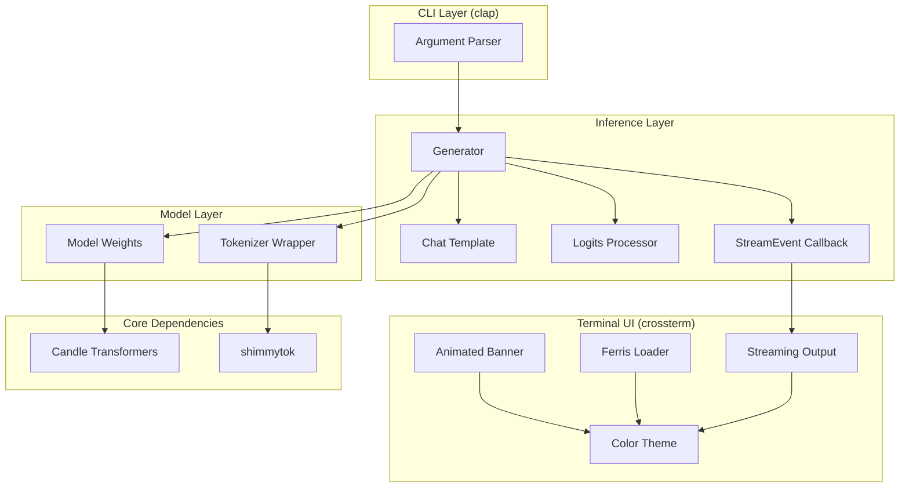
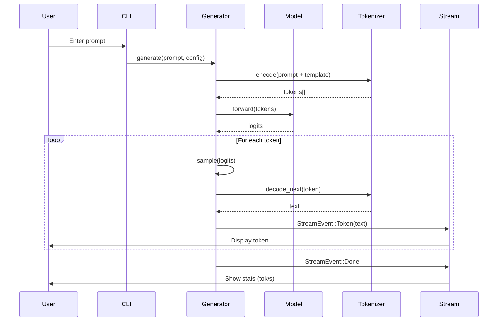

# Oxide

**Fast AI Inference CLI in Rust** — A lightweight, CPU-based LLM inference engine inspired by llama.cpp.

[](https://www.rust-lang.org/)
[](https://opensource.org/licenses/MIT)

## Features

- **GGUF Model Support** — Load quantized models in GGUF format
- **Full Tokenizer Compatibility** — Supports all llama.cpp tokenizer types via [shimmytok](https://crates.io/crates/shimmytok) (SPM, BPE, WPM, UGM, RWKV)
- **Streaming Output** — Real-time token generation with tokens-per-second metrics
- **Multiple Sampling Strategies** — Temperature, top-k, top-p, and argmax sampling
- **Repeat Penalty** — Prevents repetitive output with configurable penalty window
- **Chat Templates** — Automatic prompt formatting for popular model families
- **Interactive REPL** — Full conversation mode with history persistence
- **One-Shot Mode** — Non-interactive generation for scripting/pipelines
- **Beautiful CLI** — Animated loading, syntax-highlighted output, terminal theming

## Installation

### Prerequisites

- Rust 1.70+ (2021 edition)
- A GGUF quantized model file

### Build from Source

```bash
# Clone the repository
git clone https://github.com/yourusername/oxide.git
cd oxide

# Build release binary
make build

# Or using cargo directly
cargo build --release
```

### Install Locally

```bash
make install
# Installs to ~/.local/bin/oxide
```

### Environment Variables

| Variable | Default | Description |
|----------|---------|-------------|
| `MODEL` | `~/Models/LFM2.5-1.2B-Instruct-Q4_K_M.gguf` | Path to GGUF model for `make run` |

```bash
# Set custom model path for make run
export MODEL=~/Models/mistral-7b-v0.1.Q4_K_M.gguf
make run

# Or inline
MODEL=~/Models/phi-3.Q4_K_M.gguf make run
```

## Quick Start

```bash
# Interactive chat mode
./target/release/oxide --model ~/Models/your-model-Q4_K_M.gguf

# One-shot generation
./target/release/oxide --model ~/Models/model.gguf --once --prompt "Write a Rust function to reverse a string"

# With custom sampling parameters
./target/release/oxide --model ~/Models/model.gguf \
  --temperature 0.8 \
  --top-k 40 \
  --top-p 0.9 \
  --repeat-penalty 1.15
```

## CLI Reference

| Flag | Default | Description |
|------|---------|-------------|
| `-m, --model` | *required* | Path to GGUF model file |
| `-t, --tokenizer` | *auto* | Path to tokenizer.json (extracted from GGUF if omitted) |
| `--max-tokens` | `512` | Maximum tokens to generate |
| `--temperature` | `0.7` | Sampling temperature (0.0 = greedy/argmax) |
| `--top-k` | *none* | Top-k sampling threshold |
| `--top-p` | *none* | Nucleus sampling threshold |
| `--repeat-penalty` | `1.1` | Penalty for repeated tokens |
| `--repeat-last-n` | `64` | Context window for repeat penalty |
| `--seed` | `299792458` | Random seed for reproducibility |
| `--max-history` | `2048` | Maximum conversation history in tokens |
| `-p, --prompt` | *none* | Input prompt (for one-shot mode) |
| `-o, --once` | `false` | Run in non-interactive mode |
| `--clear-history` | `false` | Clear saved conversation history |

## Interactive Commands

| Command | Description |
|---------|-------------|
| `/clear` | Clear conversation history |
| `/exit` or `/quit` | Exit the program |
| `/help` | Show available commands |

## Supported Models

### Model Architectures

Oxide uses [Candle](https://github.com/huggingface/candle) for inference. 

> **Note**: Any GGUF model with LLaMA-compatible architecture should work. This includes most popular open-source models.

### Tokenizer Support

Oxide uses [shimmytok](https://crates.io/crates/shimmytok) for tokenizer support, providing 100% llama.cpp compatibility:

| Tokenizer Type | Description |
|----------------|-------------|
| **SPM** | SentencePiece (LLaMA, Mistral, etc.) |
| **BPE** | Byte-Pair Encoding (GPT-2 style) |
| **WPM** | WordPiece Model (BERT style) |
| **UGM** | Unigram Model |
| **RWKV** | RWKV tokenizers |

### Chat Templates

Oxide automatically applies the correct chat template based on model name detection:

| Model Family | Template Format | Notes |
|--------------|-----------------|-------|
| SmolLM | `<\|im_start\|>user\n...<\|im_end\|>` | Includes system prompt |
| LFM | `<\|im_start\|>user\n...<\|im_end\|>` | ChatML-style |
| Gemma | `<start_of_turn>user\n...<end_of_turn>` | Google's format |
| Mistral / Zephyr | `[INST] ... [/INST]` | LLaMA-2 instruct style |
| Phi | `user\n...<\|end\|>\nassistant\n` | Microsoft Phi format |
| Default | `user\n...\nassistant\n` | Fallback for unknown models |

> **Fallback**: Models not matching known patterns use a simple `user/assistant` format.

## Architecture



### Data Flow



## Development

```bash
# Development build (faster compile)
make dev

# Run with model (uses MODEL env var)
make run

# Or override MODEL inline
make run MODEL=~/path/to/model.gguf

# Format code
make fmt

# Run linter
make check

# Clean build artifacts
make clean
```

## Dependencies

| Crate | Purpose |
|-------|---------|
| `candle-core` | Tensor operations, ML primitives |
| `candle-nn` | Neural network layers |
| `candle-transformers` | Pre-built model architectures (LLaMA, LFM2) |
| `shimmytok` | GGUF tokenizer (100% llama.cpp compatible) |
| `clap` | CLI argument parsing with derive macros |
| `crossterm` | Cross-platform terminal control |
| `anyhow` | Ergonomic error handling |
| `serde_json` | History serialization |
| `tracing` | Structured logging |

## Performance

- **CPU-only inference** — No GPU dependencies, portable binaries
- **Quantized models** — Q4_K_M provides good quality/speed tradeoff; other quantizations supported
- **Streaming decode** — Tokens displayed as generated for responsive UX
- **Context caching** — Efficient multi-turn conversations with history management

## Roadmap

- [ ] Multi-modal support
- [ ] OpenAI-compatible API server
- [ ] Model download/management

## License

MIT License — see [LICENSE](LICENSE) for details.

## Acknowledgments

- [Candle](https://github.com/huggingface/candle) — HuggingFace's minimalist ML framework for Rust
- [llama.cpp](https://github.com/ggerganov/llama.cpp) — Inspiration and GGUF format specification
- [shimmytok](https://crates.io/crates/shimmytok) — Pure Rust GGUF tokenizer with llama.cpp compatibility
