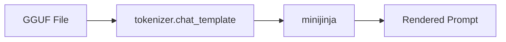
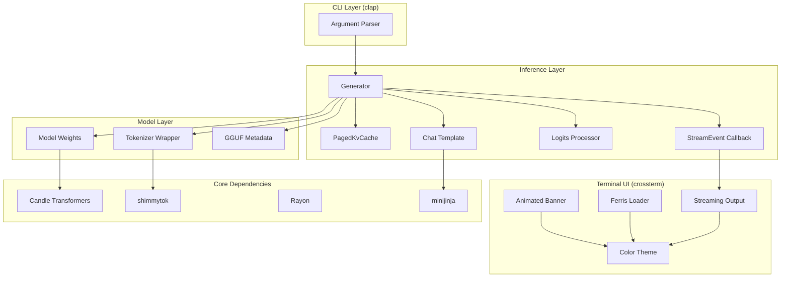
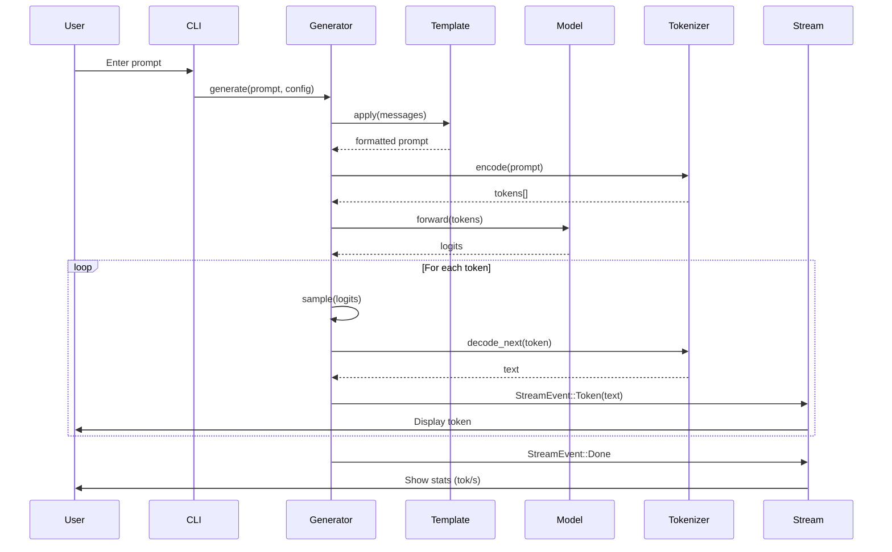

# Oxide-rs

**Fast AI Inference Library & CLI in Rust** — A lightweight, CPU-based LLM inference engine inspired by llama.cpp.

[](https://www.rust-lang.org/)
[](https://opensource.org/licenses/MIT)

## Features

- **GGUF Model Support** — Load quantized models in GGUF format
- **Full Tokenizer Compatibility** — Supports all llama.cpp tokenizer types via [shimmytok](https://crates.io/crates/shimmytok) (SPM, BPE, WPM, UGM, RWKV)
- **Tokenizer JSON Extraction** — Extracts and caches tokenizer.json from GGUF when available
- **Automatic Chat Templates** — Uses Jinja templates embedded in GGUF files via [minijinja](https://crates.io/crates/minijinja)
- **Streaming Output** — Real-time token generation with tokens-per-second metrics
- **Multiple Sampling Strategies** — Temperature, top-k, top-p, and argmax sampling
- **Repeat Penalty** — Prevents repetitive output with configurable penalty window
- **Interactive REPL** — Full conversation mode with session history
- **One-Shot Mode** — Non-interactive generation for scripting/pipelines
- **Batch Processing** — Parallel tokenization for multiple prompts
- **PagedAttention Ready** — Infrastructure for KV cache management (future integration)
- **Beautiful CLI** — Animated loading, syntax-highlighted output, Rust-themed
- **Smart Defaults** — Default system prompt reduces hallucinations, temperature tuned for accuracy
- **Model Warmup** — Pre-compiles compute kernels on startup for faster first-token generation
- **Memory-Mapped Loading** — OS-managed paging for instant load times and lower memory usage
- **Safe Thread Configuration** — Uses rayon ThreadPoolBuilder instead of unsafe env vars
- **Pre-allocated Buffers** — Zero-copy runtime allocations for smooth generation
- **Tokenizer Caching** — Caches tokenizer to disk for faster subsequent loads
- **Page Prefetching** — Preloads hot model pages into memory for faster first-token
- **Quantization Display** — Shows actual quantization from GGUF metadata or filename

## Installation

### Prerequisites

- Rust 1.70+ (2021 edition)
- A GGUF quantized model file with embedded chat template

### Build from Source

```bash
# Clone the repository
git clone https://github.com/theawakener0/oxide-rs.git
cd oxide-rs

# Build release binary
make build

# Or using cargo directly
cargo build --release
```

### Install Locally

```bash
make install
# Installs to ~/.local/bin/oxide-rs
```

### Install via Cargo

```bash
cargo install oxide-rs
```

This installs the CLI to `~/.cargo/bin/oxide-rs`. Then run:

```bash
oxide-rs -m model.gguf --once --prompt "Hello"
```

### Environment Variables

| Variable | Default | Description |
|----------|---------|-------------|
| `MODEL` | `~/Models/LFM2.5-1.2B-Instruct-Q4_K_M.gguf` | Path to GGUF model for `make run` |

```bash
# Set custom model path for make run
export MODEL=~/Models/mistral-7b-v0.1.Q4_K_M.gguf
make run

# Or inline
MODEL=~/Models/phi-3.Q4_K_M.gguf make run
```

## Quick Start

```bash
# Interactive chat mode (uses default helpful system prompt)
./target/release/oxide-rs --model ~/Models/your-model-Q4_K_M.gguf

# With custom system prompt
./target/release/oxide-rs --model ~/Models/model.gguf --system "You are a Rust expert."

# One-shot generation
./target/release/oxide-rs --model ~/Models/model.gguf --once --prompt "Write a Rust function to reverse a string"

# With custom sampling parameters
./target/release/oxide-rs --model ~/Models/model.gguf \
  --temperature 0.8 \
  --top-k 40 \
  --top-p 0.9 \
  --repeat-penalty 1.15
```

## Use as a Library

Add oxide-rs to your Rust project:

```bash
cargo add oxide-rs
```

Or add manually to `Cargo.toml`:

```toml
[dependencies]
oxide-rs = "0.1.0"
```

### Basic Usage

```rust
use oxide_rs::{generate, GenerateOptions};

fn main() -> Result<(), Box<dyn std::error::Error>> {
    let result = generate(
        "model.gguf",
        GenerateOptions::default(),
        "Hello, how are you?",
    )?;
    println!("{}", result);
    Ok(())
}
```

### Builder API

```rust
use oxide_rs::Model;

fn main() -> Result<(), Box<dyn std::error::Error>> {
    let mut model = Model::new("model.gguf")
        .with_options(oxide_rs::GenerateOptions {
            max_tokens: 256,
            temperature: 0.7,
            ..Default::default()
        })
        .load()?;

    let response = model.generate("What is Rust?")?;
    println!("{}", response);
    Ok(())
}
```

For more examples, see the [docs/](docs/) directory.

## CLI Reference

| Flag | Default | Description |
|------|---------|-------------|
| `-m, --model` | *required* | Path to GGUF model file |
| `-t, --tokenizer` | *auto* | Path to tokenizer.json (extracted from GGUF if omitted) |
| `-s, --system` | *auto* | System prompt (defaults to helpful assistant prompt) |
| `--max-tokens` | `512` | Maximum tokens to generate |
| `--temperature` | `0.3` | Sampling temperature (0.0 = greedy/argmax) |
| `--top-k` | *none* | Top-k sampling threshold |
| `--top-p` | *none* | Nucleus sampling threshold |
| `--repeat-penalty` | `1.1` | Penalty for repeated tokens |
| `--repeat-last-n` | `64` | Context window for repeat penalty |
| `--seed` | `299792458` | Random seed for reproducibility |
| `--threads` | *auto* | Number of threads for inference (auto-detects optimal) |
| `-p, --prompt` | *none* | Input prompt (for one-shot mode) |
| `-o, --once` | `false` | Run in non-interactive mode |

## Interactive Commands

| Command | Description |
|---------|-------------|
| `/clear` | Clear conversation history for current session |
| `/exit` or `/quit` | Exit the program |
| `/help` | Show available commands |

## Chat Templates

Oxide automatically uses the chat template embedded in GGUF files:



### How It Works

1. **Extraction** — Reads `tokenizer.chat_template` from GGUF metadata
2. **Rendering** — Uses [minijinja](https://crates.io/crates/minijinja) to render Jinja2 templates
3. **Multi-turn** — Maintains conversation history within the session

### Example Template (ChatML)

```jinja2

<|im_start|>{{ message.role }}
{{ message.content }}<|im_end|>

<|im_start|>assistant
```

### Supported Models

Any GGUF model with an embedded `tokenizer.chat_template` will work automatically:

| Model Family | Template Source |
|--------------|-----------------|
| LLaMA 3.x | Embedded in GGUF |
| Mistral | Embedded in GGUF |
| Qwen | Embedded in GGUF |
| Gemma | Embedded in GGUF |
| Phi-3 | Embedded in GGUF |
| SmolLM | Embedded in GGUF |
| LFM | Embedded in GGUF |

> **Note**: If your GGUF file lacks a chat template, Oxide will error and ask you to use a model with an embedded template.

## Supported Models

### Model Architectures

Oxide uses [Candle](https://github.com/huggingface/candle) for inference:

- **LLaMA** — LLaMA 2, LLaMA 3, Mistral, Qwen, Phi, etc.
- **LFM2** — Liquid Foundation Models

> **Note**: Any GGUF model with LLaMA-compatible or LFM2 architecture should work.

### Tokenizer Support

Oxide uses [shimmytok](https://crates.io/crates/shimmytok) for tokenizer support, providing 100% llama.cpp compatibility:

| Tokenizer Type | Description |
|----------------|-------------|
| **SPM** | SentencePiece (LLaMA, Mistral, etc.) |
| **BPE** | Byte-Pair Encoding (GPT-2 style) |
| **WPM** | WordPiece Model (BERT style) |
| **UGM** | Unigram Model |
| **RWKV** | RWKV tokenizers |

## Architecture



### Data Flow



## Development

```bash
# Development build (faster compile)
make dev

# Run with model (uses MODEL env var)
make run

# Or override MODEL inline
make run MODEL=~/path/to/model.gguf

# Format code
make fmt

# Run linter
make check

# Clean build artifacts
make clean
```

## Dependencies

| Crate | Purpose |
|-------|---------|
| `candle-core` | Tensor operations, ML primitives |
| `candle-nn` | Neural network layers |
| `candle-transformers` | Pre-built model architectures (LLaMA, LFM2) |
| `shimmytok` | GGUF tokenizer (100% llama.cpp compatible) |
| `rayon` | Parallel iteration and thread pool management |
| `minijinja` | Jinja2 template engine for chat templates |
| `clap` | CLI argument parsing with derive macros |
| `crossterm` | Cross-platform terminal control |
| `anyhow` | Ergonomic error handling |
| `serde` | Serialization for messages |
| `tracing` | Structured logging |

## Performance

- **CPU-only inference** — No GPU dependencies, portable binaries
- **Quantized models** — Q4_K_M provides good quality/speed tradeoff; other quantizations supported
- **Streaming decode** — Tokens displayed as generated for responsive UX
- **Parallel batch tokenization** — Multiple prompts tokenized concurrently
- **Memory-efficient generation** — Reduced allocations per prompt
- **Context caching** — Efficient multi-turn conversations with token history management
- **Model warmup** — Pre-compiles compute kernels on startup for faster first-token generation
- **Smart defaults** — Temperature 0.3 for factual accuracy, default system prompt reduces hallucinations
- **Safe threading** — Rayon ThreadPoolBuilder for predictable thread management

## Roadmap

- [ ] PagedAttention integration (full KV cache support)
- [ ] Multi-modal support
- [ ] OpenAI-compatible API server
- [ ] Model download/management

## License

MIT License — see [LICENSE](LICENSE) for details.

## Acknowledgments

- [Candle](https://github.com/huggingface/candle) — HuggingFace's minimalist ML framework for Rust
- [llama.cpp](https://github.com/ggerganov/llama.cpp) — Inspiration and GGUF format specification
- [shimmytok](https://crates.io/crates/shimmytok) — Pure Rust GGUF tokenizer with llama.cpp compatibility
- [minijinja](https://crates.io/crates/minijinja) — Minimal Jinja2 template engine for Rust
