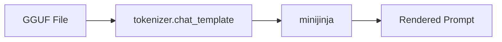
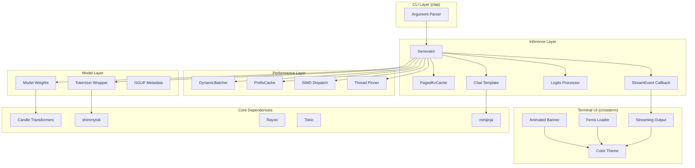
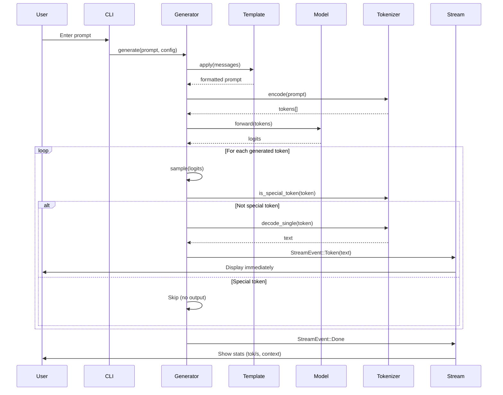

# Oxide-rs

**Fast AI Inference Library & CLI in Rust** — A lightweight, CPU-based LLM inference engine inspired by llama.cpp.

[](https://www.rust-lang.org/)
[](https://opensource.org/licenses/MIT)

## Features

- **GGUF Model Support** — Load quantized models in GGUF format
- **Full Tokenizer Compatibility** — Supports all llama.cpp tokenizer types via [shimmytok](https://crates.io/crates/shimmytok) (SPM, BPE, WPM, UGM, RWKV)
- **Tokenizer JSON Extraction** — Extracts and caches tokenizer.json from GGUF when available
- **Automatic Chat Templates** — Uses Jinja templates embedded in GGUF files via [minijinja](https://crates.io/crates/minijinja)
- **True Token-by-Token Streaming** — Real-time streaming with immediate token display
- **Automatic Special Token Filtering** — Uses tokenizer's built-in detection (no hardcoded patterns)
- **Multiple Sampling Strategies** — Temperature, top-k, top-p, and argmax sampling
- **Repeat Penalty** — Prevents repetitive output with configurable penalty window
- **Interactive REPL** — Full conversation mode with session history
- **One-Shot Mode** — Non-interactive generation for scripting/pipelines
- **Batch Processing** — Parallel tokenization for multiple prompts
- **Dynamic Batching Ready** — Infrastructure for API batching (future integration)
- **PagedAttention Ready** — Infrastructure for KV cache management (future integration)
- **Beautiful CLI** — Animated loading, syntax-highlighted output, Rust-themed
- **Smart Defaults** — Default system prompt reduces hallucinations, temperature tuned for accuracy
- **Model Warmup** — Pre-compiles compute kernels on startup for faster first-token generation
- **Memory-Mapped Loading** — OS-managed paging for instant load times and lower memory usage
- **Thread Pinning** — Configurable CPU thread management for consistent performance
- **SIMD Runtime Detection** — Auto-detects AVX2/AVX-512/NEON for optimal performance
- **Thread Pinning** — CPU-affine thread pools for consistent performance
- **Pre-allocated Buffers** — Zero-copy runtime allocations for smooth generation
- **Tokenizer Caching** — Caches tokenizer to disk for faster subsequent loads
- **Page Prefetching** — Preloads hot model pages into memory for faster first-token
- **Quantization Display** — Shows actual quantization from GGUF metadata or filename
- **Live tok/s Display** — Real-time tokens-per-second updates during generation
- **Context Tracking** — Shows context usage in loading info and generation stats
- **Configurable Performance** — Batch size, threads, SIMD level configurable via CLI
- **Model Download** — Download GGUF models directly from HuggingFace Hub
- **Model Management** — Track and manage locally downloaded models

## Installation

### Prerequisites

- Rust 1.70+ (2021 edition)
- A GGUF quantized model file with embedded chat template

### Build from Source

```bash
# Clone the repository
git clone https://github.com/theawakener0/oxide-rs.git
cd oxide-rs

# Build release binary
cargo build --release
```

### Install via Cargo

```bash
cargo install oxide-rs
```

This installs the CLI to `~/.cargo/bin/oxide-rs`. Then run:

```bash
oxide-rs --model model.gguf --once --prompt "Hello"
```

## Quick Start

```bash
# Download a model from HuggingFace (auto-selects best GGUF quantization)
oxide-rs --download "meta-llama/Llama-3.2-1B-Instruct"

# List locally downloaded models
oxide-rs --models

# Show model info before downloading
oxide-rs --info "Qwen/Qwen2.5-0.5B-Instruct"

# Interactive chat mode (uses default helpful system prompt)
./target/release/oxide-rs --model ~/Models/your-model-Q4_K_M.gguf

# With custom system prompt
./target/release/oxide-rs --model ~/Models/model.gguf --system "You are a Rust expert."

# One-shot generation
./target/release/oxide-rs --model ~/Models/model.gguf --once --prompt "Write a Rust function to reverse a string"

# With custom sampling parameters
./target/release/oxide-rs --model ~/Models/model.gguf \
  --temperature 0.8 \
  --top-k 40 \
  --top-p 0.9 \
  --repeat-penalty 1.15
```

## Use as a Library

Add oxide-rs to your Rust project:

```bash
cargo add oxide-rs
```

Or add manually to `Cargo.toml`:

```toml
[dependencies]
oxide-rs = "0.1.14"
```

### Basic Usage

```rust
use oxide_rs::{generate, GenerateOptions};

fn main() -> Result<(), Box<dyn std::error::Error>> {
    let result = generate(
        "model.gguf",
        GenerateOptions::default(),
        "Hello, how are you?",
    )?;
    println!("{}", result);
    Ok(())
}
```

### Builder API

```rust
use oxide_rs::Model;

fn main() -> Result<(), Box<dyn std::error::Error>> {
    let mut model = Model::new("model.gguf")
        .with_options(oxide_rs::GenerateOptions {
            max_tokens: 256,
            temperature: 0.7,
            ..Default::default()
        })
        .load()?;

    let response = model.generate("What is Rust?")?;
    println!("{}", response);
    Ok(())
}
```

For more examples, see the [docs/](docs/) directory.

## CLI Reference

### Model Management

| Flag | Description |
|------|-------------|
| `--download <repo>` | Download a model from HuggingFace Hub |
| `--models` | List all locally downloaded models |
| `--info <repo>` | Show information about a model on HuggingFace |
| `--remove <id>` | Remove a model from local storage |

### Generation

| Flag | Default | Description |
|------|---------|-------------|
| `-m, --model` | *required* | Path to GGUF model file |
| `-t, --tokenizer` | *auto* | Path to tokenizer.json (extracted from GGUF if omitted) |
| `-s, --system` | *auto* | System prompt (defaults to helpful assistant prompt) |
| `--max-tokens` | `512` | Maximum tokens to generate |
| `--temperature` | `0.3` | Sampling temperature (0.0 = greedy/argmax) |
| `--top-k` | *none* | Top-k sampling threshold |
| `--top-p` | *none* | Nucleus sampling threshold |
| `--repeat-penalty` | `1.1` | Penalty for repeated tokens |
| `--repeat-last-n` | `64` | Context window for repeat penalty |
| `--batch-size` | `128` | Number of tokens for warmup (1 = minimal warmup) |
| `--max-batch-size` | `8` | Maximum batch size for dynamic batching |
| `--batch-window-ms` | `100` | Time window (ms) for batching requests |
| `--seed` | `299792458` | Random seed for reproducibility |
| `--threads` | *auto* | Number of threads (0 = auto-detect n-1) |
| `--reserve-cores` | `0` | Number of cores to reserve for OS |
| `--simd-level` | `auto` | SIMD level (auto, avx512, avx2, neon, scalar) |
| `-p, --prompt` | *none* | Input prompt (for one-shot mode) |
| `-o, --once` | `false` | Run in non-interactive mode |

## Interactive Commands

| Command | Description |
|---------|-------------|
| `/clear` | Clear conversation history for current session |
| `/context` | Show context usage (tokens used / limit / %) |
| `/stats` | Show model info, settings, and context |
| `/exit` or `/quit` | Exit the program |
| `/help` | Show available commands |

## Chat Templates

Oxide automatically uses the chat template embedded in GGUF files:


```mermaid
graph LR
    A[GGUF File] --> B[tokenizer.chat_template]
    B --> C[minijinja]
    C --> D[Rendered Prompt]
```

### How It Works

1. **Extraction** — Reads `tokenizer.chat_template` from GGUF metadata
2. **Rendering** — Uses [minijinja](https://crates.io/crates/minijinja) to render Jinja2 templates
3. **Multi-turn** — Maintains conversation history within the session

### Example Template (ChatML)

```jinja2

<|im_start|>{{ message.role }}
{{ message.content }}<|im_end|>

<|im_start|>assistant
```

### Supported Models

Any GGUF model with an embedded `tokenizer.chat_template` will work automatically:

| Model Family | Template Source |
|--------------|-----------------|
| LLaMA 3.x | Embedded in GGUF |
| Mistral | Embedded in GGUF |
| Qwen | Embedded in GGUF |
| Gemma | Embedded in GGUF |
| Phi-3 | Embedded in GGUF |
| SmolLM | Embedded in GGUF |
| LFM | Embedded in GGUF |

> **Note**: If your GGUF file lacks a chat template, Oxide will error and ask you to use a model with an embedded template.

## Supported Models

### Model Architectures

Oxide uses [Candle](https://github.com/huggingface/candle) for inference:

- **LLaMA** — LLaMA 2, LLaMA 3, Mistral, Qwen, Phi, etc.
- **LFM2** — Liquid Foundation Models

> **Note**: Any GGUF model with LLaMA-compatible or LFM2 architecture should work.

### Tokenizer Support

Oxide uses [shimmytok](https://crates.io/crates/shimmytok) for tokenizer support, providing 100% llama.cpp compatibility:

| Tokenizer Type | Description |
|----------------|-------------|
| **SPM** | SentencePiece (LLaMA, Mistral, etc.) |
| **BPE** | Byte-Pair Encoding (GPT-2 style) |
| **WPM** | WordPiece Model (BERT style) |
| **UGM** | Unigram Model |
| **RWKV** | RWKV tokenizers |

## Architecture


```mermaid
graph TB
    subgraph CLI["CLI Layer (clap)"]
        args[Argument Parser]
    end

    subgraph TUI["Terminal UI (crossterm)"]
        banner[Animated Banner]
        loader[Ferris Loader]
        stream[Streaming Output]
        theme[Color Theme]
    end

    subgraph Inference["Inference Layer"]
        generator[Generator]
        kv_cache[PagedKvCache]
        template[Chat Template]
        sampler[Logits Processor]
        callback[StreamEvent Callback]
    end

    subgraph Optimizations["Performance Layer"]
        dynamic_batcher[DynamicBatcher]
        prefix_cache[PrefixCache]
        simd_dispatch[SIMD Dispatch]
        thread_pinner[Thread Pinner]
    end

    subgraph Model["Model Layer"]
        model[Model Weights]
        tokenizer[Tokenizer Wrapper]
        metadata[GGUF Metadata]
    end

    subgraph Core["Core Dependencies"]
        candle[Candle Transformers]
        shimmytok[shimmytok]
        rayon[Rayon]
        tokio[Tokio]
        minijinja[minijinja]
    end

    args --> generator
    generator --> template
    generator --> sampler
    generator --> kv_cache
    generator --> model
    generator --> tokenizer
    generator --> callback
    
    callback --> stream
    template --> minijinja
    
    model --> candle
    tokenizer --> shimmytok
    
    generator --> dynamic_batcher
    generator --> prefix_cache
    generator --> simd_dispatch
    generator --> thread_pinner
    
    banner --> theme
    loader --> theme
    stream --> theme
```

### Data Flow


```mermaid
sequenceDiagram
    participant User
    participant CLI
    participant Generator
    participant Template
    participant Model
    participant Tokenizer
    participant Stream

    User->>CLI: Enter prompt
    CLI->>Generator: generate(prompt, config)
    Generator->>Template: apply(messages)
    Template-->>Generator: formatted prompt
    Generator->>Tokenizer: encode(prompt)
    Tokenizer-->>Generator: tokens[]
    Generator->>Model: forward(tokens)
    Model-->>Generator: logits
    
    loop For each generated token
        Generator->>Generator: sample(logits)
        Generator->>Tokenizer: is_special_token(token)
        alt Not special token
            Generator->>Tokenizer: decode_single(token)
            Tokenizer-->>Generator: text
            Generator->>Stream: StreamEvent::Token(text)
            Stream->>User: Display immediately
        else Special token
            Generator->>Generator: Skip (no output)
        end
    end
    
    Generator->>Stream: StreamEvent::Done
    Stream->>User: Show stats (tok/s, context)
```

## Development

```bash
# Development build (faster compile)
cargo build

# Run interactively
cargo run --release -- --model ~/path/to/model.gguf

# Run in one-shot mode
cargo run --release -- --model ~/path/to/model.gguf --once --prompt "Hello"

# Download a model
cargo run --release -- --download "meta-llama/Llama-3.2-1B-Instruct"

# List downloaded models
cargo run --release -- --models

# Get model info
cargo run --release -- --info "Qwen/Qwen2.5-0.5B-Instruct"

# Remove a model
cargo run --release -- --remove "llama-3.2-1b-q4_k_m"

# Format code
cargo fmt

# Run linter
cargo check

# Run tests
cargo test

# Clean build artifacts
cargo clean
```

## Model Download

Oxide can download GGUF models directly from HuggingFace Hub:

```bash
# Download a model (auto-selects best Q4 quantization)
oxide-rs --download "meta-llama/Llama-3.2-1B-Instruct"

# Download specific model
oxide-rs --download "unsloth/Qwen3.5-0.8B-GGUF"

# List downloaded models
oxide-rs --models

# Get model info before downloading
oxide-rs --info "Qwen/Qwen2.5-0.5B-Instruct"

# Remove a model from registry
oxide-rs --remove "qwen2.5-0.5b-q4_k_m"
```

### How It Works

1. **Repository Query** — Queries HuggingFace API for available files
2. **Auto-Selection** — Automatically selects best GGUF file (Q4_K_M priority)
3. **Download** — Downloads to HuggingFace cache (~/.cache/huggingface/hub/)
4. **Registry** — Tracks downloaded models in ~/.oxide/models.json

Models are stored in the HuggingFace cache, compatible with python huggingface_hub.

## Dependencies

| Crate | Purpose |
|-------|---------|
| `candle-core` | Tensor operations, ML primitives |
| `candle-nn` | Neural network layers |
| `candle-transformers` | Pre-built model architectures (LLaMA, LFM2) |
| `shimmytok` | GGUF tokenizer (100% llama.cpp compatible) |
| `rayon` | Parallel iteration and thread pool management |
| `tokio` | Async runtime for dynamic batching |
| `minijinja` | Jinja2 template engine for chat templates |
| `clap` | CLI argument parsing with derive macros |
| `crossterm` | Cross-platform terminal control |
| `anyhow` | Ergonomic error handling |
| `serde` | Serialization for messages |
| `tracing` | Structured logging |
| `hf-hub` | HuggingFace Hub integration for model downloads |
| `dirs` | Platform-specific directory paths |
| `reqwest` | HTTP client for API requests |
| `chrono` | Date/time handling for model registry |

## Performance

- **CPU-only inference** — No GPU dependencies, portable binaries
- **Quantized models** — Q4_K_M provides good quality/speed tradeoff; other quantizations supported
- **True token-by-token streaming** — Immediate token display as generated
- **Automatic special token filtering** — Uses shimmytok's built-in is_special_token() for all tokenizers
- **Optimized decode_single** — shimmytok's native single-token decoding for fast streaming
- **Parallel batch tokenization** — Multiple prompts tokenized concurrently
- **Memory-efficient generation** — Reduced allocations per prompt
- **Context caching** — Efficient multi-turn conversations with token history management
- **Model warmup** — Minimal 1-token warmup primes branch predictor (~50ms)
- **Smart defaults** — Temperature 0.3 for factual accuracy, default system prompt reduces hallucinations
- **Thread pinning** — CPU-affine thread pools for consistent performance
- **SIMD runtime detection** — Auto-detects AVX2/AVX-512/NEON, uses optimal code paths
- **Tokenizer caching** — Disk cache for instant subsequent loads
- **Memory-mapped loading** — OS-managed paging, madvise hints for read-ahead


For more details, see [Performance Guide](docs/performance.md).

## Roadmap

- [ ] PagedAttention integration (full KV cache support)
- [ ] OpenAI-compatible API server
- [ ] Multi-modal support

## License

MIT License — see [LICENSE](LICENSE) for details.

## Acknowledgments

- [Candle](https://github.com/huggingface/candle) — HuggingFace's minimalist ML framework for Rust
- [llama.cpp](https://github.com/ggerganov/llama.cpp) — Inspiration and GGUF format specification
- [shimmytok](https://crates.io/crates/shimmytok) — Pure Rust GGUF tokenizer with llama.cpp compatibility
- [minijinja](https://crates.io/crates/minijinja) — Minimal Jinja2 template engine for Rust
